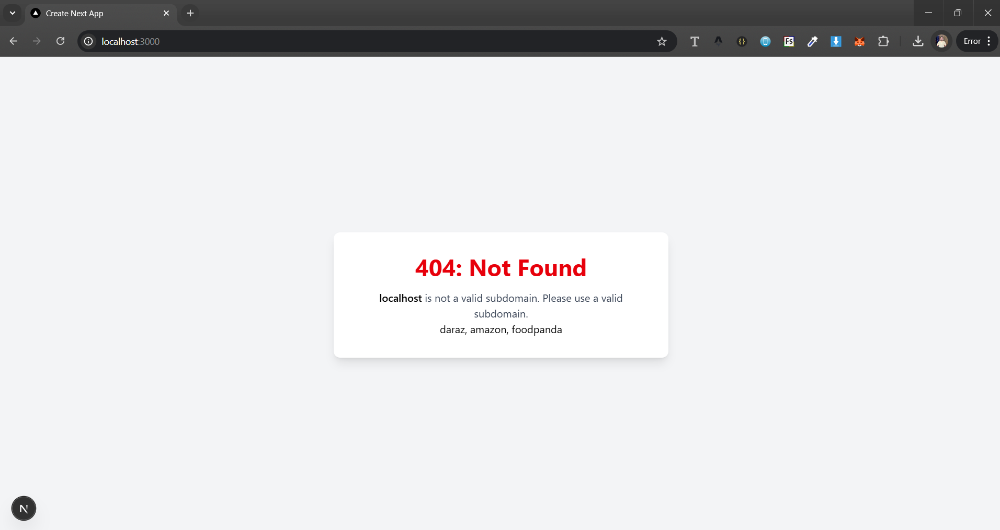
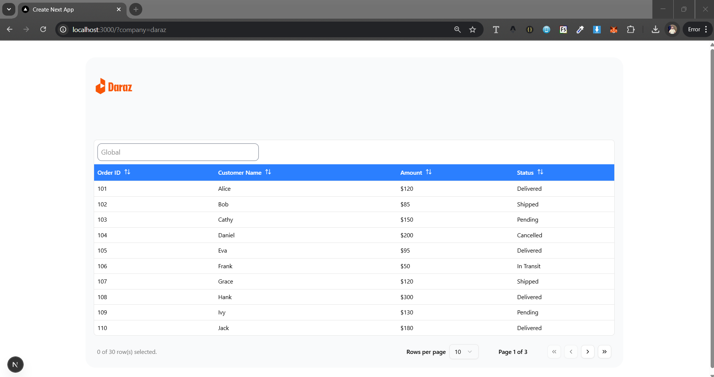
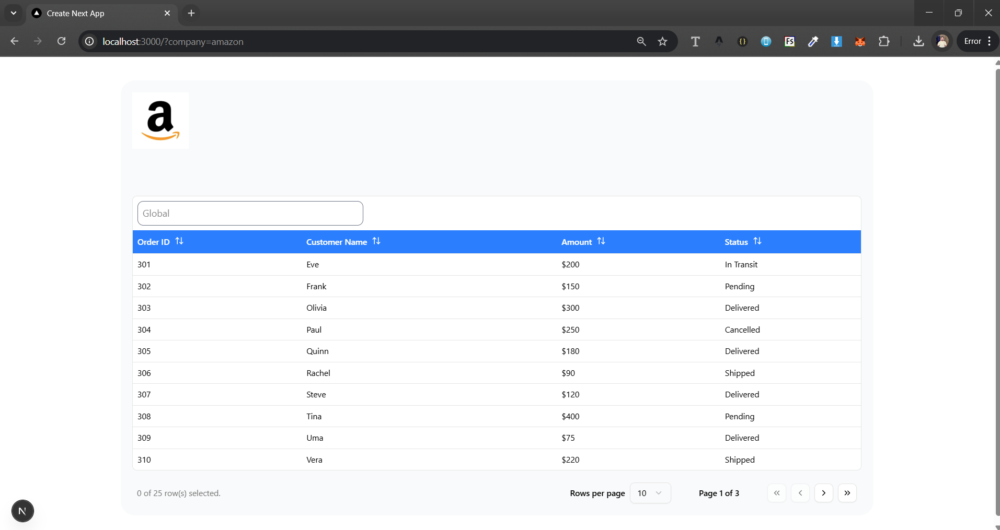

# Order Management

This is a white-label order management platform built with [Next.js](https://nextjs.org). Companies can access their orders by visiting the appropriate subdomain.

## Features

- **Dynamic Subdomains**: Orders and logos are dynamically rendered based on the subdomain.
- **UI**: A simple and clean design with company logos and order tables.
- **Sortable Columns**: Orders table supports ascending and descending sorting.
- **Pagination**: Displays 10 orders per page for better readability.

## Getting Started

### Local Development Setup

Run the development server:

```bash
npm run dev
# or
yarn dev
# or
pnpm dev
# or
bun dev

```
For local development, since subdomains may not work, you can test using query parameters:

```
http://localhost:3000?company=daraz
```

This simulates accessing `daraz.ordermade.com` in production.

### Adding a New Company

To add a new company:
1. Add the company name to `registerCompanies` array in `page.tsx`.
2. Update the `sampleOrders` object with the company’s logo and order data.


## Learn More

To learn more about Next.js, check out these resources:

- [Next.js Documentation](https://nextjs.org/docs) - Learn about Next.js features and API.
- [Learn Next.js](https://nextjs.org/learn) - An interactive Next.js tutorial.

## Deployment

I also deploy it to vercel [Deployment Link](https://order-mangment-ten.vercel.app/).


## Screenshots





